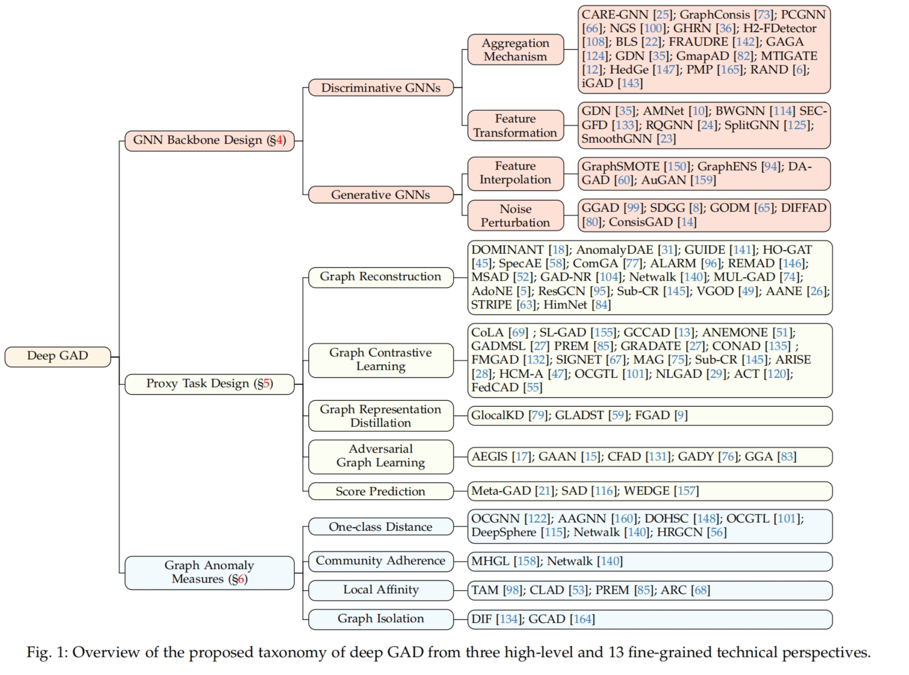
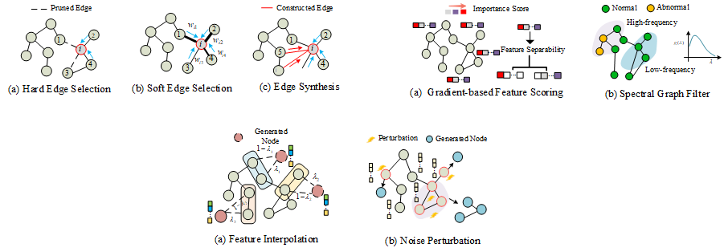
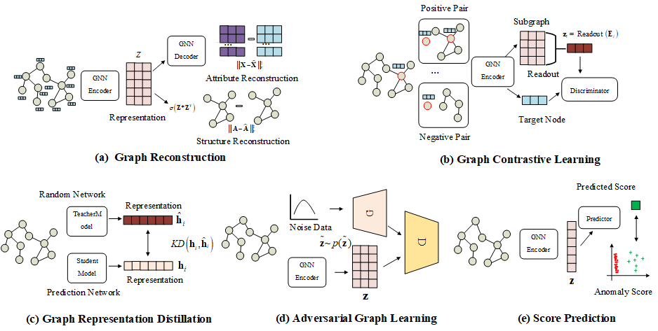
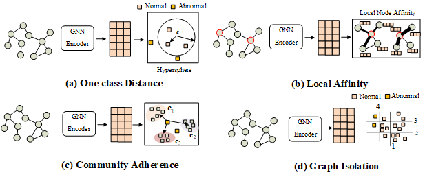

# Deep Graph Anomaly Detection (DGAD): A Survey and New Perspectives
[](https://awesome.re) 
 

[](https://badges.pufler.dev/visits/mala-lab/Awesome-Deep-Graph-Anomaly-Detection)
 

A professionally curated list of awesome resources (paper, code, data, etc.) on **Deep Graph Anomaly Detection (DGAD)**, which is the first work to comprehensively and systematically summarize the recent advances of deep graph anomaly detection from the methodology design to the best of our knowledge.

We will continue to update this list with the newest resources. If you find any missed resources (paper/code) or errors, please feel free to open an issue or make a pull request.

 
## Survey Paper 

[**Deep Graph Anomaly Detection: A Survey and New Perspectives**](Arxiv)  

[Hezhe Qiao](https://hezheqiao2022.github.io/), [Hanghang Tong](http://tonghanghang.org/), [Bo An](https://personal.ntu.edu.sg/boan/), [Irwin King](https://www.cse.cuhk.edu.hk/people/faculty/irwin-king/), [Charu Aggarwal](https://www.charuaggarwal.net/), [Guansong Pang](https://sites.google.com/site/gspangsite/home).


[****](Arxiv)  


#### If you find this repository helpful for your work, please kindly cite our paper.

```bibtex

```


## Taxonomy of  Deep Graph Anomaly Detection
 <br />


# Outline

The outline corresponds to the taxonomy of Problems in our [survey paper](xxx).

- [1. GNN Backbone Design](https://github.com/mala-lab/Awesome-Deep-Graph-Anomaly-Detection#GNN-Backbone-Design)
  - [1.1 Discriminative GNNs](https://github.com/mala-lab/Awesome-Deep-Graph-Anomaly-Detection#Discriminative-GNNs)
    - [1.1.1 Aggregation Mechanism](https://github.com/mala-lab/Awesome-Deep-Graph-Anomaly-Detection#Aggregation-Mechanism)
    - [1.1.2 Feature Transformation](https://github.com/mala-lab/Awesome-Deep-Graph-Anomaly-Detection#Feature-Transformation)
  - [1.2 Generative GNNs](https://github.com/mala-lab/Awesome-Deep-Graph-Anomaly-Detection#Generative-GNNs)
    - [1.2.1 Feature Interpolation](https://github.com/mala-lab/Awesome-Deep-Graph-Anomaly-Detection#Feature-Interpolation)
    - [1.2.2 Noise Perturbation](https://github.com/mala-lab/Awesome-Deep-Graph-Anomaly-Detection#Noise-Perturbation)
- [2. Proxy Task Design](https://github.com/mala-lab/Awesome-Deep-Graph-Anomaly-Detection#Proxy-Task-Design)
    - [2.1 Graph Reconstruction](https://github.com/mala-lab/Awesome-Deep-Graph-Anomaly-Detection#Graph-Reconstruction)
    - [2.2 Graph Contrastive Learning](https://github.com/mala-lab/Awesome-Deep-Graph-Anomaly-Detection#Graph-Contrastive-Learning)
    - [2.3 Graph Representation Distillati](https://github.com/mala-lab/Awesome-Deep-Graph-Anomaly-Detection#Graph-Representation-Distillation)
    - [2.4 Adversarial Graph Learning](https://github.com/mala-lab/Awesome-Deep-Graph-Anomaly-Detection#Adversarial-Graph-Learning)
    - [2.5 Score Prediction](https://github.com/mala-lab/Awesome-Deep-Graph-Anomaly-Detection#Score-Prediction)
- [3. Graph Anomaly Measures](https://github.com/mala-lab/Awesome-Deep-Graph-Anomaly-Detection#Graph-Anomaly-Measures)
    - [3.1 One-class Classification Measure](https://github.com/mala-lab/Awesome-Deep-Graph-Anomaly-Detection#One-class-Distance)
    - [3.2 Community Adherence](https://github.com/mala-lab/Awesome-Deep-Graph-Anomaly-Detection#Community-Adherence)
    - [3.3 Local Affinity](https://github.com/mala-lab/Awesome-Deep-Graph-Anomaly-Detection#Local-Affinity)
    - [3.4 Graph Isolation](https://github.com/mala-lab/Awesome-Deep-Graph-Anomaly-Detection#Graph-Isolation)
- [4. Graph Anomaly Detection Related Survey](https://github.com/mala-lab/Awesome-Deep-Graph-Anomaly-Detection#Graph-Anomaly-Detection-Related-Survey)
- [5. Anomaly Detection Related Survey](https://github.com/mala-lab/Awesome-Deep-Graph-Anomaly-Detection#Anomaly-Detection-Related-Survey)
- [6. Quantitative Comparison](https://github.com/mala-lab/Awesome-Deep-Graph-Anomaly-Detection#Quantitative-Comparison)

# Category of Deep Graph Anomaly Detection

## GNN Backbone Design 
 <br />

### Discriminative GNNs

#### Aggregation Mechanism

- [Dou2020] Enhancing Graph Neural Network-based Fraud Detectors against Camouflaged Fraudsters in *CIKM*, 2020. [\[paper\]](https://arxiv.org/abs/2008.08692)[\[code\]](https://github.com/YingtongDou/CARE-GNN)

- [Liu2020] Alleviating the Inconsistency Problem of Applying Graph Neural Network to Fraud Detection in *SIGIR*, 2020. [\[paper\]](https://arxiv.org/abs/2005.00625)[\[code\]](https://github.com/safe-graph/DGFraud)

- [Liu2021] Pick and Choose: A GNN-based Imbalanced Learning Approach for Fraud Detection in *WWW*, 2021.[\[paper\]](https://dl.acm.org/doi/pdf/10.1145/3442381.3449989)[\[code\]](https://github.com/PonderLY/PC-GNN)

- [Zhang2021] FRAUDRE: Fraud Detection Dual-Resistant to Graph Inconsistency and Imbalance  in *ICDM*, 2021. [\[paper\]](https://ieeexplore.ieee.org/document/9679178)[\[code\]](https://github.com/FraudDetection/FRAUDRE)

- [Zhang2022] Dual-discriminative Graph Neural Network for Imbalanced Graph-level Anomaly Detection in *NeurIPS*, 2022. [\[paper\]](https://proceedings.neurips.cc/paper_files/paper/2022/hash/98a625423070cfc6ae3d82d4b59408a0-Abstract-Conference.html)

- [Qin2022] Explainable Graph-based Fraud Detection via Neural Meta-graph Search in *CIKM*, 2022. [\[paper\]](https://dl.acm.org/doi/pdf/10.1145/3511808.3557598)[\[code\]](https://github.com/qzzdd/NGS)

- [Dong2022] Bi-Level Selection via Meta Gradient for Graph-based Fraud Detection in *DASFAA*, 2022. [\[paper\]](https://yliu.site/pub/BLS_DASFAA2022.pdf)

- [Shi2022] H2-FDetector: A GNN-based Fraud Detector with Homophilic and Heterophilic Connections in *WebConf*, 2022. [\[paper\]](https://dl.acm.org/doi/pdf/10.1145/3485447.3512195)

- [Gao2023] Addressing Heterophily in Graph Anomaly Detection: A Perspective of Graph Spectrum in *WebConf*, 2023. [\[paper\]](https://dl.acm.org/doi/pdf/10.1145/3543507.3583268)[\[code\]](https://github.com/blacksingular/GHRN)

- [Ma2023] Towards Graph-level Anomaly Detection via Deep Evolutionary Mapping in *KDD*, 2023. [\[paper\]](https://dl.acm.org/doi/pdf/10.1145/3580305.3599524)[\[code\]](https://github.com/XiaoxiaoMa-MQ/GmapAD/)

- [Chang2024] Multitask Active Learning for Graph Anomaly Detection in *Arxiv*, 2024. [\[paper\]](https://arxiv.org/abs/2401.13210)[\[code\]](https://github.com/AhaChang/MITIGATE)

- [Zhang2024] Generation is better than Modification: Combating High Class Homophily Variance in Graph Anomaly Detection in *Arxiv*, 2024. [\[paper\]](https://arxiv.org/abs/2403.10339)

- [Chen2024] Boosting Graph Anomaly Detection with Adaptive Message Passing in *ICLR*, 2024. [\[paper\]](https://openreview.net/forum?id=CanomFZssu)

- [Zhuo2023] Partitioning Message Passing for Graph Fraud Detection in *ICLR*, 2024. [\[paper\]](https://openreview.net/pdf?id=tEgrUrUuwA)[\[code\]](https://github.com/Xtra-Computing/PMP)

- [Gao2024] Graph Anomaly Detection with Bi-level Optimization in *WebConf*, 2024. [\[paper\]](https://dl.acm.org/doi/abs/10.1145/3589334.3645673)[\[code\]](https://github.com/blacksingular/Bio-GNN)


#### Feature Transformation

- Can Abnormality be Detected by Graph Neural Networks? in *IJCAI*, 2022. [\[paper\]](http://yangy.org/works/gnn/IJCAI22_Abnormality.pdf)[\[code\]](https://github.com/zjunet/AMNet)

- Rethinking Graph Neural Networks for Anomaly Detection in *ICML*, 2022.[\[paper\]](https://proceedings.mlr.press/v162/tang22b.html)[\[code\]](https://github.com/squareRoot3/Rethinking-Anomaly-Detection)

- Alleviating Structural Distribution Shift in Graph Anomaly Detection in *WSDM*, 2023.[\[paper\]](https://arxiv.org/abs/2401.14155)[\[code\]](https://github.com/blacksingular/wsdm_GDN)

- Rayleigh Quotient Graph Neural Networks for Graph-level Anomaly Detection in *ICLR*, 2024.[\[paper\]](https://arxiv.org/pdf/2310.02861)[\[code\]](https://github.com/xydong127/RQGNN)

- SmoothGNN: Smoothing-based GNN for Unsupervised Node Anomaly Detection in *Arxiv*, 2024. [\[paper\]](https://arxiv.org/abs/2405.17525)


### Generative GNNs

#### Feature Interpolation


- GRAPHENS:Neighbor-aware Ego Network Synthesis for Class-imbalance Node Classification in *ICLR*, 2022. [\[paper\]](https://openreview.net/forum?id=MXEl7i-iru)[\[code\]](https://github.com/JoonHyung-Park/GraphENS)

- DAGAD: Data Augmentation for Graph Anomaly Detection in *ICDM*, 2022. [\[paper\]](https://arxiv.org/abs/2210.09766)[\[code\]](https://github.com/FanzhenLiu/DAGAD)

- GADY Unsupervised Anomaly Detection on Dynamic Graphs in *Arxiv*, 2023. [\[paper\]](https://arxiv.org/abs/2310.16376)

- Generative Graph Augmentation for Minority Class in Fraud Detection in *CIKM*, 2023. [\[paper\]](https://dl.acm.org/doi/10.1145/3583780.3615255)

- Improving Generalizability of Graph Anomaly Detection Models via Data Augmentation in *TKDE*, 2023. [\[paper\]](https://arxiv.org/abs/2306.10534v1)[\[code\]](https://github.com/betterzhou/AugAN)

- Class-Imbalanced Graph Learning without Class Rebalancing in *ICML*, 2024. [\[paper\]](https://arxiv.org/abs/2308.14181)[\[code\]](https://github.com/ZhiningLiu1998/BAT)

- Consistency Training with Learnable Data Augmentation for Graph Anomaly Detection with Limited Supervision in *ICLR*, 2024. [\[paper\]](https://openreview.net/pdf?id=elMKXvhhQ9)[\[code\]](https://github.com/Xtra-Computing/ConsisGAD)

#### Noise Perturbation


- Self-Discriminative Modeling for Anomalous Graph Detection in *Arxiv*, 2023. [\[paper\]](https://arxiv.org/abs/2310.06261)

- GODM Data Augmentation for Supervised Graph Outlier Detection with Latent Diffusion Models in *Arxiv*, 2023.  [\[paper\]](https://arxiv.org/abs/2312.17679)[\[code\]](https://github.com/kayzliu/godm)

- GADY: Unsupervised Anomaly Detection on Dynamic Graphs in *Arxiv*, 2023.  [\[paper\]](https://arxiv.org/abs/2310.16376)[\[code\]](https://github.com/mufeng-74/GADY)

- Graph Anomaly Detection with Few Labels: A Data-Centric Approach in *KDD*, 2024. [\[paper\]](https://dl.acm.org/doi/10.1145/3637528.3671929)
  
- Generative Semi-supervised Graph Anomaly Detection in *Arxiv*, 2024. [\[paper\]](https://arxiv.org/abs/2402.11887)[\[code\]](https://github.com/mala-lab/GGAD)

## Proxy Task Design

 <br />

### Graph Reconstruction 

- NetWalk: A Flexible Deep Embedding Approach for Anomaly Detection in Dynamic Networks in *KDD*, 2018. [\[paper\]](https://dl.acm.org/doi/pdf/10.1145/3219819.3220024)[\[code\]](https://github.com/chengw07/NetWalk)

- Deep Anomaly Detection on Attributed Networks in *SDM*, 2019. [\[paper\]](https://epubs.siam.org/doi/epdf/10.1137/1.9781611975673.67)[\[code\]](https://github.com/kaize0409/GCN_AnomalyDetection_pytorch)

- ANOMALYDAE: Dual Autoencoder for Anomaly Detection on Attribute Networks in *ICASSP*, 2020. [\[paper\]](https://arxiv.org/abs/2002.03665)[\[code\]](https://github.com/haoyfan/AnomalyDAE)

- Outlier Resistant Unsupervised Deep Architectures for Attributed Network Embedding in *WSDM*, 2020. [\[paper\]](https://dl.acm.org/doi/10.1145/3336191.3371788)[\[code\]](https://github.com/vasco95/DONE_AdONE)

- ResGCN Attention-based Deep Residual Modeling for Anomaly Detection on Attributed Networks in *Machine Learning*, 2021. [\[paper\]](https://arxiv.org/abs/2009.14738)[\[code\]](https://bitbucket.org/paulpei/resgcn/src/master/)

- Mul-GAD: a semi-supervised graph anomaly detection framework via aggregating multi-view information in *Arxiv*, 2022. [\[paper\]](https://arxiv.org/abs/2212.05478)[\[code\]](https://github.com/liuyishoua/Mul-Graph-Fusion)

- AnomMAN: Detect Anomaly on Multi-view Attributed Networks in *Information Sciences*, 2022.[\[paper\]](https://arxiv.org/abs/2201.02822)

- A Deep Multi-View Framework for Anomaly in *TKDE*, 2022. [\[paper\]](https://ieeexplore.ieee.org/document/9162509)

- ComGA: Community-Aware Attributed Graph Anomaly Detection in *WSDM*, 2022. [\[paper\]](https://dl.acm.org/doi/10.1145/3488560.3498389)[\[code\]](https://github.com/XuexiongLuoMQ/ComGA)

- Reconstruction Enhanced Multi-View Contrastive Learning for Anomaly Detection on Attributed Networks in *IJCAI*, 2022. [\[paper\]](https://arxiv.org/abs/2205.04816)[\[code\]](https://github.com/Zjer12/Sub)

- Unsupervised Graph Outlier Detection: Problem Revisit, New Insight, and Superior Method in *Arxiv*, 2022. [\[paper\]](https://arxiv.org/abs/2210.12941)[\[code\]](https://github.com/goldenNormal/vgod-github)

- Graph-level Anomaly Detection via Hierarchical Memory Networks in *ECML PKDD*, 2023. [\[paper\]](https://arxiv.org/abs/2307.00755)[\[code\]](https://github.com/Niuchx/HimNet)

- Hybrid-Order Anomaly Detection on Attributed Networks in *TKDE*, 2023 [\[paper\]](https://ieeexplore.ieee.org/document/9560054)[\[code\]](https://github.com/zirui-yuan/HO-GAT)

- A graph encoder–decoder network for unsupervised anomaly detection in *Arxiv*, 2023. [\[paper\]](https://arxiv.org/abs/2308.07774)

- Label-based Graph Augmentation with Metapath for Graph Anomaly Detection in *Arxiv*, 2023. [\[paper\]](https://arxiv.org/abs/2308.10918)[\[code\]](https://github.com/missinghwan/INFOREP)

- GAD-NR: Graph Anomaly Detection via Neighborhood Reconstruction in *WSDM*, 2024.  [\[paper\]](https://arxiv.org/abs/2306.01951)[\[code\]](https://github.com/Graph-COM/GAD-NR)

- ADA-GAD:Anomaly-Denoised Autoencoders for Graph Anomaly Detection in *AAAI*, 2024. [\[paper\]](https://arxiv.org/abs/2312.14535)[\[code\]](https://github.com/jweihe/ADA-GAD)

- STRIPE Spatial-temporal Memories Enhanced Graph Autoencoder for Anomaly Detection in Dynamic Graphs in *Arxiv*, 2024. [\[paper\]](https://arxiv.org/abs/2403.09039)

### Graph Contrastive Learning

- ANEMONE: Graph Anomaly Detection with Multi-Scale Contrastive Learning in *CIKM*, 2021. [\[paper\]](https://dl.acm.org/doi/10.1145/3459637.3482057)


- Generative and Contrastive Self-Supervised Learning for Graph Anomaly Detection in *TKDE*, 2021. [\[paper\]](https://arxiv.org/abs/2108.09896)[\[code\]](https://github.com/KimMeen/SL-GAD)

- Anomaly Detection in Dynamic Graphs via Transformer in *TKDE*, 2021. [\[paper\]](https://arxiv.org/abs/2106.09876)[\[code\]](https://github.com/yuetan031/TADDY_pytorch)

- CoLA Anomaly Detection on Attributed Networks via Contrastive Self-Supervised Learning in *TNNLS*, 2021. [\[paper\]](https://arxiv.org/abs/2103.00113)[\[code\]](https://github.com/TrustAGI-Lab/CoLA)


- CONDA Contrastive Attributed Network Anomaly Detection with Data Augmentation in *PAKDD*, 2022. [\[paper\]](https://link.springer.com/chapter/10.1007/978-3-031-05936-0_35)[\[code\]](https://github.com/zhiming-xu/conad)

- Decoupling Representation Learning and Classification for GNN-based Anomaly Detection in *SIGIR*, 2021. [\[paper\]](https://dl.acm.org/doi/10.1145/3404835.3462944)[\[code\]](https://github.com/wyl7/DCI-pytorch)

- GCCAD:Graph Contrastive Coding for Anomaly Detection in *TKDE*, 2022. [\[paper\]](https://ieeexplore.ieee.org/document/9870034/)[\[code\]](https://github.com/THUDM/GraphCAD)

- Cross-Domain Graph Anomaly Detection via Anomaly-aware Contrastive Alignment in *AAAI*, 2022. [\[paper\]](https://arxiv.org/abs/2212.01096)[\[code\]](https://github.com/QZ-WANG/ACT)

- Reconstruction Enhanced Multi-View Contrastive Learning for Anomaly Detection on Attributed Networks in *IJCAI*, 2022. [\[paper\]](https://arxiv.org/abs/2205.04816)[\[code\]](https://github.com/Zjer12/Sub)

- Few-shot Message-Enhanced Contrastive Learning for Graph Anomaly Detection  in *Arxiv*, 2023. [\[paper\]](https://arxiv.org/abs/2311.10370)

- ARISE: Graph Anomaly Detection on Attributed Networks via Substructure Awareness in *TNNLS*, 2023. [\[paper\]](https://arxiv.org/abs/2211.15255)[\[code\]](https://github.com/FelixDJC/ARISE)

- BOURNE: Bootstrapped Self-supervised Learning Framework for Unified Graph Anomaly Detection in *Arxiv*, 2023. [\[paper\]](https://arxiv.org/abs/2307.15244)

- GOOD-D:On Unsupervised Graph Out-Of-Distribution Detection in *WSDM*, 2023.  [\[paper\]](https://arxiv.org/abs/2211.04208)[\[code\]](https://github.com/yixinliu233/g-ood-d)

- GRADATE:Graph Anomaly Detection via Multi-Scale Contrastive Learning Networks with Augmented View in *AAAI*, 2023.  [\[paper\]](https://arxiv.org/abs/2212.00535)[\[code\]](https://github.com/FelixDJC/GRADATE)

- GraphFC:Customs Fraud Detection with Label Scarcity in *Arxiv*, 2023. [\[paper\]](https://arxiv.org/abs/2305.11377)[\[code\]](https://github.com/k-s-b/gnn_wco)

- Revisiting Graph Contrastive Learning for Anomaly Detection in *Arxiv*, 2023.   [\[paper\]](https://arxiv.org/abs/2305.02496)[\[code\]](https://github.com/liuyishoua/MAG-Framework)

- Multi-representations Space Separation based Graph-level Anomaly-aware Detection in *SSDBM*, 2023.  [\[paper\]](https://arxiv.org/abs/2307.12994)[\[code\]](https://github.com/whb605/mssgad)

- Towards Self-Interpretable Graph-Level Anomaly Detection in *NeurIPS*, 2023. [\[paper\]](https://arxiv.org/abs/2310.16520)[\[code\]](https://github.com/yixinliu233/signet)

- Learning Node Abnormality with Weak Supervision  in *CIKM*, 2023. [\[paper\]](https://dl.acm.org/doi/10.1145/3583780.3614950)

- Federated Graph Anomaly Detection via Contrastive Self-Supervised Learning in *TNNLS*, 2024. [\[paper\]](https://ieeexplore.ieee.org/document/10566052)


### Graph Representation Distillati 

- Deep Graph-level Anomaly Detection by Glocal Knowledge Distillation in *CIKM*, 2020. [\[paper\]](https://dl.acm.org/doi/10.1145/3340531.3412070)[\[code\]](https://git.io/GLocalKD)

- Discriminative Graph-level Anomaly Detection via Dual-students-teacher Model in *Arxiv*, 2023. [\[paper\]](https://arxiv.org/abs/2308.01947)

- FGAD: Self-boosted Knowledge Distillation for An Effective Federated Graph Anomaly Detection Framework in *Arxiv*, 2024. [\[paper\]](https://arxiv.org/abs/2402.12761)


### Adversarial Graph Learning

- Generative Adversarial Attributed Network Anomaly Detection in *CIKM*, 2020. [\[paper\]](https://dl.acm.org/doi/abs/10.1145/3340531.3412070)[\[code\]](https://github.com/pygod-team/pygod)

- Inductive Anomaly Detection on Attributed Networks in *IJCAI*, 2021. [\[paper\]](https://www.ijcai.org/proceedings/2020/0179.pdf)[\[code\]](https://github.com/pygod-team/pygod)

- Counterfactual_Graph_Learning_for_Anomaly_Detection_on_Attributed_Networks in *TKDE*, 2023. [\[paper\]](https://github.com/ChunjingXiao/CFAD/blob/main/TKDE_23_CFAD.pdf)[\[code\]](https://github.com/ChunjingXiao/CFAD)

- Generative Graph Augmentation for Minority Class in Fraud Detection  in *Arxiv*, 2023. [\[paper\]](https://dl.acm.org/doi/10.1145/3583780.3615255)[\[code\]](https://github.com/ChunjingXiao/CFAD)

### Score Prediction

- DevNet Deep Anomaly Detection with Deviation Networks in *KDD*, 2019. [\[paper\]](https://arxiv.org/abs/1911.08623)[\[code\]](https://github.com/GuansongPang/deviation-network)

- Few-shot Network Anomaly Detection via Cross-network in *WebConf*, 2021. [\[paper\]](https://arxiv.org/pdf/2102.11165)[\[code\]](https://github.com/kaize0409/Meta-GDN_AnomalyDetection)

- SAD:Semi-Supervised Anomaly Detection on Dynamic Graphs in *IJCAI*, 2023. [\[paper\]](https://arxiv.org/abs/2305.13573)[\[code\]](https://github.com/D10Andy/SAD)

- Learning Node Abnormality with Weak Supervision in *CIKM*, 2023. [\[paper\]](https://dl.acm.org/doi/10.1145/3583780.3614950)


## Graph Anomaly Measure
 <br />
### One-class Classification Measure

- Deep into Hypersphere: Robust and Unsupervised Anomaly Discovery in Dynamic Networks in *IJCAI*, 2018. [\[paper\]](https://www.ijcai.org/proceedings/2018/0378.pdf)[\[code\]](https://github.com/picsolab/DeepSphere)

- Subtractive Aggregation for Attributed Network Anomaly Detection in *CIKM*, 2021. [\[paper\]](https://dl.acm.org/doi/10.1145/3459637.3482195?cid=99659129036)[\[code\]](https://github.com/betterzhou/AAGNN)

- HRGCN: Heterogeneous Graph-level Anomaly Detection with Hierarchical Relation-augmented Graph Neural Networks in *DSAA*, 2023. [\[paper\]](https://arxiv.org/abs/2308.14340)[\[code\]](https://github.com/jiaxililearn/HRGCN)

- Deep Graph-level Orthogonal Hypersphere Compression for Anomaly Detection in *ICLR*, 2024. [\[paper\]](https://arxiv.org/abs/2302.06430)[\[code\]](https://github.com/wownice333/DOHSC-DO2HSC)


### Community Adherence

- NetWalk: A Flexible Deep Embedding Approach for Anomaly Detection in Dynamic Networks in *KDD*, 2018. [\[paper\]](https://dl.acm.org/doi/10.1145/3219819.3220024)[\[code\]](https://github.com/chengw07/NetWalk)


- Unseen Anomaly Detection on Networks via Multi-Hypersphere Learning in *SDM*, 2024. [\[paper\]](https://epubs.siam.org/doi/10.1137/1.9781611977172.30)[\[code\]](https://github.com/betterzhou/MHGL)


### Local Affinity

- Class Label-aware Graph Anomaly Detection in *CIKM*, 2023. [\[paper\]](https://arxiv.org/abs/2308.11669)[\[code\]](https://github.com/jhkim611/CLAD)

- PREM: A Simple Yet Effective Approach for Node-Level Graph Anomaly Detection in *ICDM*, 2023. [\[paper\]](https://arxiv.org/abs/2310.11676)[\[code\]](https://github.com/CampanulaBells/PREM-GAD)

- Truncated Affinity Maximization: One-class Homophily Modeling for Graph Anomaly Detection in *NeurIPS*, 2023. [\[paper\]](https://arxiv.org/abs/2306.00006)[\[code\]](https://github.com/mala-lab/TAM-master/)

- ARC: A Generalist Graph Anomaly Detector with In-Context Learning in *Arxiv*, 2024.  [\[paper\]](https://arxiv.org/abs/2405.16771)


### Graph Isolation 

- Deep Isolation Forest for Anomaly Detection in *TKDE*, 2023. [\[paper\]](https://arxiv.org/abs/2206.06602)[\[code\]](https://github.com/xuhongzuo/deep-iforest)

- Subgraph Centralization: A Necessary Step for Graph Anomaly Detection in *SDM*,2023.  [\[paper\]](https://arxiv.org/abs/2301.06794)[\[code\]](https://github.com/IsolationKernel/Codes)


## Graph Anomaly Detection Related Survey

- A Comprehensive Survey on Graph Anomaly Detection with Deep Learning in *TKDE*, 2021.  [\[paper\]](https://arxiv.org/abs/2106.07178)

- BOND: Benchmarking Unsupervised Outlier Node Detection on Static Attributed Graphs in *NeurIPS*, 2022. [\[paper\]](https://arxiv.org/abs/2206.10071)[\[code\]](https://github.com/pygod-team/pygod/tree/main/benchmark)

- GADBench: Revisiting and Benchmarking Supervised Graph Anomaly Detection in *NeurIPS*, 2023. [\[paper\]](https://arxiv.org/abs/2306.12251)[\[code\]](https://github.com/squareRoot3/GADBench)

- A survey of imbalanced learning on graphs: Problems, techniques, and future direction  in *Arxiv*, 2024. [\[paper\]](https://arxiv.org/abs/2308.13821)

- Unifying Unsupervised Graph-Level Anomaly Detection and Out-of-Distribution Detection:A Benchmark in *Arxiv*, 2024. [\[paper\]](https://arxiv.org/abs/2406.15523)[\[code\]](https://github.com/UB-GOLD/UB-GOLD)

##  Anomaly Detection Related Survey

- Deep Learning for Anomaly Detection: A Review in *CSUR*, 2020. [\[paper\]](https://arxiv.org/abs/2007.02500)

- Weakly Supervised Anomaly Detection: A Survey in *Arxiv*, 2023. [\[paper\]](https://arxiv.org/abs/2302.04549)[\[code\]](https://github.com/yzhao062/wsad)

- Large Language Models for Anomaly and Out-of-Distribution Detection: A Survey in *Arxiv*, 2024. [\[paper\]](https://arxiv.org/abs/2409.01980)

## Quantitative Comparison
#### Quantitative comparison of node-level anomaly detection on datasets with manually injected (synthetic) anomalies
|Metric   | Setting  | Cora | Citeseer | ACM | BlogCatalog | Flicker | Pubmed | Facebook | Reddit | Weibo |
|---|------|----------|-----|-------------|---------|--------|----------|--------|-------|-------|
|AUROC                      | DOMINANT [Ding2019]        | 0.815 | 0.825 | 0.760 | 0.746 | 0.744 | 0.808 | 0.554 | 0.560 | 0.850 |
| AUROC                     | CoLA [Liu2021]             | 0.878 | 0.896 | 0.823 | 0.785 | 0.751 | 0.951 | /     | 0.603 | /     |
| AUROC                     | SL-GAD [Zheng2021]   | 0.913 | 0.913 | 0.853 | 0.818 | 0.796 | 0.967 | /     | 0.567 | /     |
| AUROC                     | CONAD [Xu2022]      | 0.788 | /     | /     | /     | /     | /     | 0.863 | 0.561 | 0.854 |
| AUROC                     | AEGIS [Ding2021]      | /     | /     | /     | 0.743 | 0.738 | 0.773 | /     | /     | /     |
| AUROC                     | OCGNN [Wang2021]            | 0.881 | 0.856 | /     | /     | /     | 0.747 | 0.793 | /     | /     |
| AUROC                     | ComGA [Luo2022]           | 0.884 | 0.916 | 0.849 | 0.814 | 0.799 | 0.922 | 0.659 | /     | /     |
| AUROC                     | AAGNN [Zhou2021]    | /     | /     | /     | 0.818 | 0.829 | 0.856 | /     | /     | 0.925 |
| AUROC                     | HCM-A [Huang2022]           | /     | /     | 0.761 | 0.798 | 0.792 | /     | /     | /     | /     |
| AUROC                     | GAAN  [Chen2020]     | 0.742 | /     | 0.877 | 0.765 | 0.753 | /     | /     | 0.554 | 0.925 |
| AUROC                     | AnomalyDAE [Fan2020] | 0.762 | 0.727 | 0.778 | 0.783 | 0.751 | 0.810 | /     | 0.557 | 0.915 |
| AUROC                     | GAD-NR [Roy2023]            | 0.835 | /     | /     | /     | /     | /     | /     | /     | 0.623 |
| AUROC                     | TAM [Qiao2023]       | /     | /     | 0.887 | 0.824 | /     | /     | 0.914 | 0.602 | /     |
| AURPC                     | DOMINANT [Ding2019]        | 0.200 | /     | /     | 0.338 | 0.324 | 0.299 | /     | 0.037 | /     |
| AURPC                     | CoLA [Liu2021]             | /     | /     | 0.323 | 0.327 | /     | /     | 0.211 | 0.044 | /     |
| AURPC                     | SL-GAD  [Zheng2021]  | /     | /     | /     | 0.388 | 0.378 | /     | 0.131 | 0.041 | /     |
| AURPC                     | CONAD [Xu2022]      | /     | /     | /     | /     | /     | /     | /     | 0.037 | /     |
| AURPC                     | AEGIS [Ding2021]      | /     | /     | /     | 0.339 | 0.324 | 0.373 | /     | /     | /     |
| AURPC                     | OCGNN [Wang2021]            | /     | /     | /     | /     | /     | /     | /     | /     | /     |
| AURPC                     | ComGA [Luo2022]           | /     | /     | /     | /     | /     | /     | /     | /     | /     |
| AURPC                     | AAGNN [Zhou2021]    | /     | /     | /     | 0.435 | 0.421 | 0.428 | /     | /     | /     |
| AURPC                     | HCM-A [Huang2022]           | /     | /     | /     | /     | /     | /     | /     | /     | /     |
| AURPC                     | GAAN  [Chen2020]     | /     | /     | /     | 0.338 | 0.324 | 0.337 | /     | 0.037 | /     |
| AURPC                     | AnomalyDAE [Fan2020] | 0.183 | /     | /     | /     | /     | /     | /     | /     | /     |
| AURPC                     | GAD-NR [Roy2023]            | /     | /     | /     | /     | /     | /     | /     | /     | /     |
| AURPC                     | TAM [Qiao2023]       | /     | /     | 0.512 | 0.418 | /     | /     | 0.223 | 0.044 | /     |


#### Quantitative comparison of node-level anomaly detection on datasets with genuine anomalies
| Metric  |  Setting   | Amazon | YelpChi | T-Finance | Question | Elliptic | Reddit | Tolokers | Weibo | DGraph | T-Social | Photo | CS |
|---|--------|---------|-----------|----------|----------|--------|----------|-------|--------|----------|-------|----|----|
|AUROC                     |Unsupervised                | DOMINANT [Ding2019]       | 0.694 | 0.539 | 0.538 | /     | 0.296 | 0.556 | /     | /     | 0.574 | /     | 0.514 | 0.402 |
|AUROC                     |Unsupervised                           | CoLA [Liu2021]            | 0.261 | 0.480 | 0.483 | /     | /     | 0.603 | /     | /     | /     | /     | /     | 0.481 |
|AUROC                     |Unsupervised                           | CLAD [Kim2023]           | 0.203 | 0.476 | 0.139 | 0.621 | 0.419 | 0.578 | 0.406 | /     | /     | /     | /     | /     |   
|AUROC                     |Unsupervised                           | GRADATE [Duan2023]       | 0.478 | 0.492 | 0.406 | 0.554 | /     | 0.526 | 0.537 | /     | /     | /     | /     | /     |   
|AUROC                     |Unsupervised                           | GAD-NR [Roy2023]           | 0.260 | 0.470 | 0.579 | 0.587 | 0.400 | 0.553 | 0.576 | /     | /     | /     | /     | /     |
|AUROC                     |Unsupervised                           | Prem [Pan2023]            | 0.278 | 0.490 | 0.448 | 0.603 | 0.497 | 0.551 | 0.565 | /     | /     | /     | /     | /     |
|AUROC                     |Unsupervised                           | TAM [Qiao2023]      | 0.802 | 0.548 | 0.690 | 0.504 | /     | 0.572 | 0.469 | /     | /     | /     | /     | /     |
|AUROC                     |Unsupervised                           | SmoothGNN [Dong2024] | 0.840 | 0.575 | 0.755 | 0.644 | 0.572 | 0.594 | 0.687 | /     | 0.649 | 0.703 | /     | /     |
|AUROC                     |Semi-supervised                        | GGAD [Qiao2024]     | 0.944 | /     | 0.823 | /     | 0.729 | /     | /     | /     | 0.594 | /     | 0.648 | /     |
|AUROC                     |Supervised                           | BWGNN [Tang2022]    | 0.980 | 0.849 | 0.961 | 0.718 | 0.852 | 0.654 | 0.804 | 0.973 | 0.763 | 0.920 | /     | /     |
|AUROC                     |Supervised                           | DCI [Wang2021]      | 0.946 | 0.778 | 0.868 | 0.692 | 0.828 | 0.665 | 0.755 | 0.942 | 0.747 | 0.808 | /     | /     |
|AUROC                     |Supervised                           | AMNet [Chai2022]           | 0.970 | 0.826 | 0.937 | 0.681 | 0.773 | 0.684 | 0.768 | 0.953 | 0.731 | 0.536 | /     | /     |
|AUROC                     |Supervised                           | GHRN [Gao2023]     | 0.981 | 0.853 | 0.96  | 0.718 | 0.854 | 0.660 | 0.804 | 0.967 | 0.761 | 0.790 | /     | /     |
|AUROC                     |Supervised                           | NGS [Qin2022]      | 0.973 | 0.921 | /     | /     | /     | /     | /     | /     | /     | /     | /     | /     |
|AUROC                     |Supervised                           | PCGNN [Liu2021]           | 0.973 | 0.797 | 0.933 | 0.699 | 0.858 | 0.532 | 0.728 | 0.902 | 0.720 | 0.692 | /     | /     |
|AUROC                     |Supervised                           | GDN [Gao2023]       | 0.971 | 0.903 | /     | /     | /     | /     | /     | /     | /     | /     | /     | /     |
|AUROC                     |Supervised                           | DevNet [Pang2019]         | /     | /     | 0.654 | /     | /     | /     | /     | /     | /     | /     | 0.599 | 0.606 |
|AUROC                     |Supervised                           | PReNet [Pang2023]         | /     | /     | 0.892 | /     | /     | /     | /     | /     | /     | /     | 0.698 | 0.632 |
|AUROC                     |Supervised                           | NSReg [Wang2023]          | /     | /     | 0.929 | /     | /     | /     | /     | /     | /     | /     | 0.908 | 0.797 |
|AUPRC                     |Unsupervised                          | DOMINANT [Ding2019]       | 0.102 | 0.165 | 0.047 | /     | /     | 0.036 | /     |       | 0.008 | /     | 0.104 | 0.187 |
|AUPRC                     |Unsupervised                           | CoLA [Liu2021]            | 0.052 | 0.136 | 0.041 | /     | /     | 0.045 | /     | /     | /     | /     | 0.246 | 0.253 |
|AUPRC                     |Unsupervised                           | CLAD [Kim2023]           | 0.040 | 0.128 | 0.025 | 0.051 | 0.081 | 0.050 | 0.192 | /     | /     | /     | /     | /     |   
|AUPRC                     |Unsupervised                           | GRADATE [Duan2023]       | 0.063 | 0.145 | 0.038 | 0.035 | /     | 0.039 | 0.236 | /     | /     | /     | /     | /     |   
|AUPRC                     |Unsupervised                           | GADNR [Roy2023]            | 0.042 | 0.139 | 0.054 | 0.057 | 0.077 | 0.037 | 0.299 | /     | /     | /     | /     | /     |
|AUPRC                     |Unsupervised                           | Prem [Pan2023]            | 0.074 | 0.137 | 0.039 | 0.043 | 0.090 | 0.041 | 0.259 | /     | /     | /     | /     | /     |
|AUPRC                     |Unsupervised                           | TAM [Qiao2023]      | 0.332 | 0.173 | 0.128 | 0.039 | /     | 0.042 | 0.196 | /     | /     | /     | /     | /     |
|AUPRC                     |Unsupervised                           | SmoothGNN [Dong2024] | 0.395 | 0.182 | 0.140 | 0.059 | 0.116 | 0.043 | 0.351 | /     | 0.019 | 0.063 | /     | /     |
|AUPRC                     |Semi-supervised                        | GGAD [Qiao2024]     | 0.792 | /     | 0.183 | /     | 0.243 | 0.061 | /     | /     | 0.008 | /     | 0.144 | /     |
|AUPRC                     |Supervised                           | BWGNN [Tang2022]    | 0.891 | 0.551 | 0.866 | 0.167 | 0.260 | 0.069 | 0.497 | 0.930 | 0.040 | 0.549 | /     | /     |
|AUPRC                     |Supervised                           | DCI [Wang2021]      | 0.815 | 0.395 | 0.626 | 0.141 | 0.254 | 0.061 | 0.399 | 0.896 | 0.036 | 0.138 | /     | /     |
|AUPRC                     |Supervised                           | AMNet [Chai2022]           | 0.873 | 0.488 | 0.743 | 0.146 | 0.147 | 0.073 | 0.432 | 0.897 | 0.028 | 0.031 | /     | /     |
|AUPRC                     |Supervised                           | GHRN [Gao2023]      | 0.895 | 0.566 | 0.866 | 0.167 | 0.277 | 0.072 | 0.499 | 0.918 | 0.04  | 0.163 | /     | /     |
|AUPRC                     |Supervised                           | NGS [Qin2022]      | /     | /     | /     | /     | /     | /     | /     | /     | /     | /     | /     | /     |
|AUPRC                     |Supervised                           | PCGNN  [Liu2021]          | 0.878 | 0.437 | 0.698 | 0.144 | 0.356 | 0.042 | 0.381 | 0.819 | 0.028 | 0.087 | /     | /     |
|AUPRC                     |Supervised                           | DevNet [Pang2019]         | /     | /     | 0.323 | /     | /     | /     | /     | /     | /     | /     | 0.468 | 0.537 |
|AUPRC                     |Supervised                           | PReNet [Pang2023]}         | /     | /     | 0.571 | /     | /     | /     | /     | /     | /     | /     | 0.460 | 0.557 |
|AUPRC                     |Supervised                           | NSReg [Wang2023]          | /     | /     | 0.757 | /     | /     | /     | /     | /     | /     | /     | 0.836 | 0.752 |


#### Quantitative comparison of graph-level anomaly detection

| Metric | Methods | PROTEINS-F | ENZYMES | AIDS | DHFR | BZR | COX2 | DD | NCI1 | IMDB | COLLAB | HSE | MMP | P53 | TraceLog | FlowGraph |
|---|---|------------|---------|------|------|-----|------|----|------|------|--------|-----|-----|-----|----------|-----------|
|AUROC                | GlocalKD [Ma2022]          | 0.773 | 0.613 | 0.932 | 0.567 | 0.694 | 0.593 | 0.801 | 0.684 | 0.521 | 0.674 | 0.593 | 0.675 | 0.640 | /     | /     |
|AUROC                | OCGIN [Zhao2023]          | 0.708 | 0.587 | 0.781 | 0.492 | 0.659 | 0.535 | 0.722 | 0.719 | 0.601 | /     | /     | /     | /     | /     | /     |
|AUROC                | SIGNET [Liu2024]        | 0.752 | 0.629 | 0.972 | 0.740 | 0.814 | 0.714 | 0.727 | 0.748 | 0.664 | /     | /     | /     | /     | /     | /     |
|AUROC                | OCGTL [Qiu2022]         | 0.765 | 0.620 | 0.994 | 0.599 | 0.639 | 0.552 | 0.794 | 0.734 | 0.640 | /     | /     | /     | /     | /     | /     |
|AUROC                | OCGCN  [Wang2021]           | 0.718 | 0.613 | 0.664 | 0.495 | 0.658 | 0.628 | 0.605 | 0.627 | 0.536 | /     | 0.388 | 0.457 | 0.483 | /     | /     |
|AUROC                | HimNet [Niu2023]          | 0.772 | 0.589 | 0.997 | 0.701 | 0.703 | 0.637 | 0.806 | 0.686 | 0.553 | 0.683 | 0.613 | 0.703 | 0.646 | /     | /     |
|AUROC                | GLADST [Lin2023]           | /     | 0.694 | 0.976 | 0.773 | 0.810 | 0.630 | /     | 0.681 | /     | 0.776 | 0.547 | 0.685 | 0.688 | /     | /     |
|AUROC                | DIF [Xu2023]              | /     | /     | /     | /     | /     | /     | /     | /     | /     | /     | 0.737 | 0.715 | 0.680 | /     | /     |
|AUROC                | HRGCN [Li2023]            | /     | /     | /     | /     | /     | /     | /     | /     | /     | /     | /     | /     | /     | 0.864 | 1.000 |


